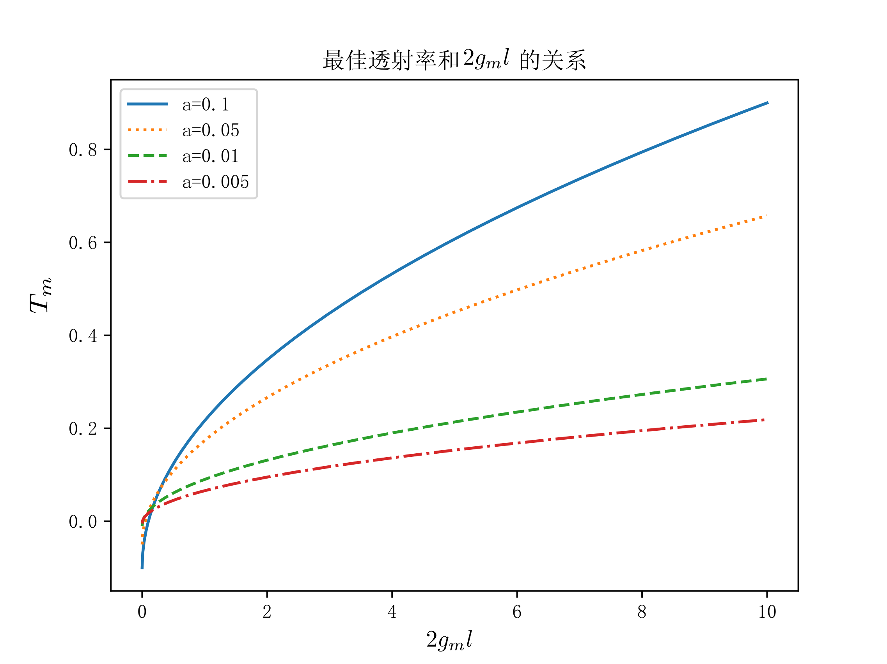
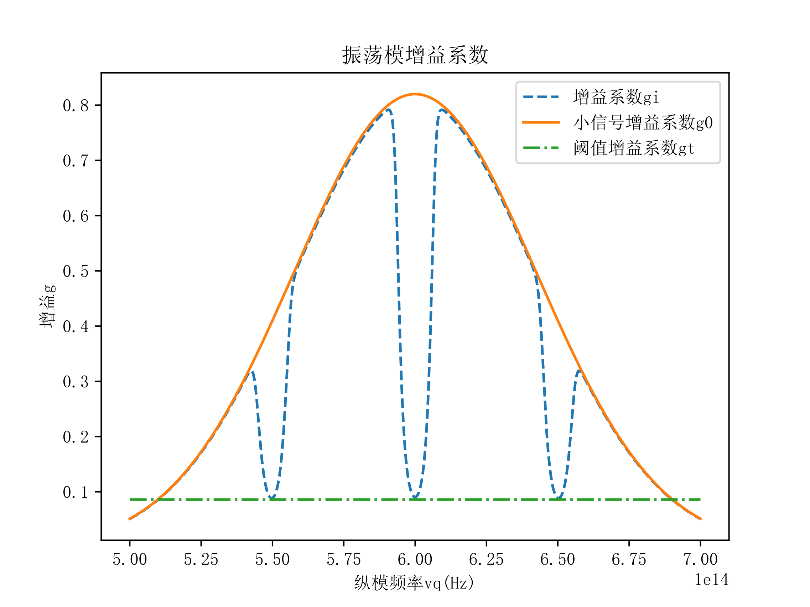

<meta http-equiv="Content-Type" content="text/html; charset=utf-8">

1. 图4.3.2 (P.147)均匀加宽单模连续激光器最佳透射率与2gml关系曲线
==

根据公式(4.3.6)$T_{m}=\sqrt{2g_{H}^{0}(\nu_{q})la}-a$可以画出此图

2. 图4.3.3 (P.147)均匀加宽单模连续激光器输出功率与透射率的关系曲线
==

将$I_{\nu_{q}}$简写为$I$，$I_{s}(\nu_{q})$简写为$I_{s}$，$g_{H}^{0}(\nu_{q},I_{\nu q})$简写为$g_{0}$
由
$$I=I_{+}+I_{-}$$
$$I_{+}(1-T)=I_{-}$$
$$I_{-}e^{2g_{t}l-a}(1-T)=I_{-}$$
解出
$$g_{t}=\frac{a-ln(1-T)}{2l}$$
因
$$\frac{g_{0}}{1+\frac{I}{I_{s}}}=g_{t}=\frac{a-ln(1-T)}{2l}$$
解出
$$I=I_s (\frac{g_0 2l}{a-ln(1-T)}-1)$$
又
$$\frac{I_{+}+I_{-}}{2}=I$$
得
$$I_{+}(2-T)=2I=2I_{s}(\frac{g_{0}2l}{a-ln(1-T)}-1)$$
得
$$I_{+}=\frac{2I_{s}(\frac{2g_{0}l}{a-ln(1-T)}-1)}{2-T}$$
则
$$P=ATI_{+}=\frac{2ATI_{s}}{2-T}(\frac{2g_{0}l}{a-ln(1-T)}-1)$$
根据此公式即可画出此图

3. 图4.3.4(a) (P.148)非均匀加宽单模连续激光器振荡模增益系数曲线
==

由(4.3.8)式：

$$g_{i}(\nu_{q},I_{\nu_{q}})=\frac{g_{m}}{\sqrt{1+\frac{I_{+}}{I_{s}}}}e^{-4ln2\frac{(\nu_{q}-\nu_{0})^{2}}{\Delta\nu_{D}^{2}}}$$
取
$\Delta\nu_{D}=1\times10^{14}Hz$，$\nu_{0}=6\times10^{14}Hz$，$g_{m}=0.82$
再考虑到烧孔效应，取$\delta\nu=3\times10^{12}Hz$，纵模间距$\Delta\nu_{q}=5\times10^{11}Hz$
结合输出光强与频率的关系可绘制此图

4. 图4.3.4(b) (P148)非均匀加宽单模连续激光器单模输出功率与单模频率关系曲线
==

取
$\frac{l}{\delta}=10m$，$I_{s}AT=15W$，$\Delta\nu_{D}=1\times10^{14}Hz$，$\nu_{0}=6\times10^{14}Hz$，$g_{m}=0.82$
由(4.3.10)式
$$P_{0}=AI_{s}T\lbrace[\frac{g_{m}l}{\delta}e^{-4ln2\frac{(\nu_{q}-\nu_{0})^{2}}{\Delta\nu_{D}^{2}}}]^{2}-1\rbrace$$
再考虑到烧孔效应，取$\delta\nu=3\times10^{12}Hz$，即可得到兰姆凹陷后的单模输出功率$P$与单模频率$\nu_{q}$的关系曲线

5. 图5.3.1 (P.165)归一化小信号增益和归一化掺杂光纤长度关系曲线
==

取 
$\gamma=1.1$，$\beta_{p}^{0}=2m^{-1}$，$\beta^{0}=1m^{-1}$
已知
$$\frac{I_{p0}}{I_{pth}}=\frac{P_{p0}}{P_{pth}}$$
结合公式(5.3.18)
$$ln[\gamma\frac{I_{p0}}{I_{pth}}-\frac{\gamma}{\gamma+1}\frac{\beta_{p}^{0}}{\beta^{0}}lnG^{0}]+\frac{1}{\gamma+1}\beta_{p}^{0}l-\frac{\gamma}{\gamma+1}\frac{\beta_{p}^{0}}{\beta^{0}}lnG^{0}=ln(\gamma\frac{I_{p0}}{I_{pth}})$$
即可画出此图

6. 图5.3.2 (P.166)归一化小信号增益和归一化泵浦功率关系曲线
==

取 
$\gamma=1.1$，$\beta_{p}^{0}=3m^{-1}$，$\beta^{0}=1m^{-1}$
已知
$$\frac{I_{p0}}{I_{pth}}=\frac{P_{p0}}{P_{pth}}$$
结合公式(5.3.18)
$$ln[\gamma\frac{I_{p0}}{I_{pth}}-\frac{\gamma}{\gamma+1}\frac{\beta_{p}^{0}}{\beta^{0}}lnG^{0}]+\frac{1}{\gamma+1}\beta_{p}^{0}l-\frac{\gamma}{\gamma+1}\frac{\beta_{p}^{0}}{\beta^{0}}lnG^{0}=ln(\gamma\frac{I_{p0}}{I_{pth}})$$
即可画出此图

7. 图5.3.4 (P.167)归一化信号输入/输出光功率特性曲线
==

取
$\frac{\beta^{0}}{\beta_{p}^{0}}=2.42$，$\nu_{p}=0.01Hz$，$\nu=10Hz$，$P_{pth}=0.001W$
由

$$
\frac{\nu_{p}}{\nu}(G_{m}-1)I_{0}+I_{pth}[\frac{\beta_{p}^{0}}{\beta^{0}}lnG_{m}+ln\frac{I_{p0}}{I_{pth}}]=I_{p0}-I_{pth}
$$

结合

$$
g_{m}=\frac{P_{m}}{P_{0}}
$$

$$
\frac{I_{p0}}{I_{pth}}=\frac{P_{p0}}{P_{pth}}
$$

$$
\frac{I_{0}}{I_{pth}}=\frac{P_{0}}{P_{pth}}
$$

即可画出此图

8. 图5.4.2 (P.171)脉冲放大器输出能量和长度的关系曲线
==

对A曲线，取
$J(0)h\nu=0.1J\cdot cm^{-2}$

对B曲线，取
$J(0)h\nu=1.0J\cdot cm^{-2}$

对C曲线，取
$J(0)h\nu=2.5J\cdot cm^{-2}$

取

$h\nu\Delta n^{0}=2.0J\cdot cm^{-3}$，$\alpha=0.05cm^{-1}$

再将(5.4.15)左右同乘$h\nu$：
$$h\nu J(z)=\frac{h\nu\Delta n^{0}}{2\alpha}+J(0)h\nu e^{-\alpha l}-\frac{h\nu\Delta n^{0}}{2\alpha}e^{-\alpha l}$$

即可画出此曲线

9. 图5.5.4 (P.176)均匀加宽工作物质自发辐射谱线宽度与工作物质长度关系曲线
=

由公式
$$\delta\nu_{sH}=\Delta\nu_{H}\sqrt{\frac{g^{0}(\nu_{0})z}{ln\frac{exp[g^{0}(\nu_{0})z]+1}{2}}}-1$$

可画出此图

10. 图5.5.5 (P.176)非均匀加宽工作物质自发辐射谱线宽度与工作物质长度关系曲线
=

由公式
$$\delta\nu_{si}=\Delta\nu_{D}\sqrt{\frac{lng^{0}(\nu_{0})z-lnln\frac{1}{2}[e^{g^{0}(\nu_{0})z}+1]}{ln2}}$$

可画出此图

A.公式(6.6.7)和(6.6.8)输出倍频光和基频光最大功率和工作物质长度的关系曲线
=

根据(6.6.7)
$$
P_{2m}=\frac{1}{2}AI_{s}(\nu_{q})[\sqrt{2g_{H}^{0}(\nu_{q})l}-\sqrt{a}]^{2}
$$

和(6.6.8)
$$
P_{1m}=\frac{1}{2}AI_{s}(\nu_{q})(\sqrt{\frac{2g_{H}^{0}(\nu_{q})l}{a}}-1)
$$

令$a=1W^{-1}$，$AI_{s}(\nu_{q})=5W$，即可得到此图

B.公式(6.6.10)和公式(6.6.11)差频光和信号光的光功率与腔长的关系曲线
=

由公式(6.6.10)
$$
P_{1}(L)=\frac{\nu_{1}}{\nu_{2}}P_{2}(0)\frac{\kappa^{2}sinh^{2}[(\kappa^{2}-\frac{\Delta k^{2}}{4})^{\frac{1}{2}}L]}{(\kappa^{2}-\frac{\Delta k^{2}}{4})}
$$

$$
P_{2}(L)=P_{2}(0)[1+\frac{\kappa^{2}sinh^{2}[(\kappa^{2}-\frac{\Delta k^{2}}{4})^{\frac{1}{2}}L]}{(\kappa^{2}-\frac{\Delta k^{2}}{4})}]
$$

令$\kappa=100m^{-1}$，$\frac{\nu_{1}}{\nu_{2}}=1$，$\Delta k=5m^{-1}$，$P_{2}(0)=1W$即可得到此图

C.公式(4.5.13)单模激光器极限线宽与无源腔中本征模式线宽的关系曲线
=

由公式(4.5.13)
$$
\Delta\nu_{s}=\frac{n_{2t}}{\Delta n_{t}}\frac{2\pi(\Delta\nu_{c})^{2}h\nu_{0}}{P_{0}}
$$

令$n_{2t}=10^{-3}m^{-3}$，$h\nu_{0}=10^{-10}J$，$P_{0}=1W$即可得到此图

D.公式(5.4.22)输出光子流强度随时间变化关系曲线
==

由公式(5.4.22)
$$
G_{p}=\frac{e^{\sigma_{21}\Delta n^{0}l}}{e^{\sigma_{21}\Delta n^{0}l}-(e^{\sigma_{21}\Delta n^{0}l}-1)e^{-2\sigma_{21}J_{0}t}}
$$

令$\sigma_{21}=10^{-3}m^{2}$，$\Delta n^{0}l=3\times10^{3}m^{-2}$，$J_{0}=1m^{-2}$即可得到此图

E.公式(2.6.2)方形镜共焦腔高斯光束9阶模光强分布
=

由
$$
H_{9}(x)
=  -e^{x^{2}}\frac{d^{9}}{dx^{9}}(e^{-x^{2}})\\
=  -e^{x^{2}}\left(-30240e^{-x^{2}}x-512e^{-x^{2}}x^{9}+9216e^{-x^{2}}x^{7}-48384e^{-x^{2}}x^{5}+80640e^{-x^{2}}x^{3}\right)
$$

及
$$
I=(A_{9\ 9}E_{0}\frac{w_{0}}{w(z)}H_{9}[\frac{\sqrt{2}}{w(z)}x]H_{9}[\frac{\sqrt{2}}{w(z)}y]e^{-\frac{r^{2}}{w^{2}(z)}})^{2}
$$

取$A_{9\ 9}=1$，$E_{0}=1$，$w_{0}=0.01$，$w(z)=0.03$（所有变量均使用国际单位制），即可画出此图。

该项目的Github网址：
=

[github.com/chaihahaha/laser-principle-plot](https://github.com/chaihahaha/laser-principle-plot)
